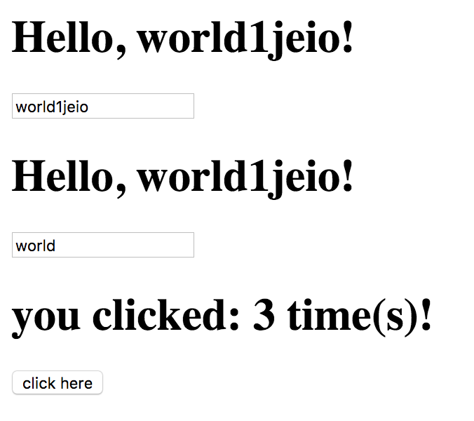

# Recordize &middot; [](https://travis-ci.org/ricokahler/recordize)

> a state management library revolving around simplicity amd immutable records

**This library is a big work-in-progress!** There are no released versions yet. Check back soon.

Recordize is a framework for creating React applications that Revolve around immutable records.

## Create a record class

```ts
import * as Record from 'recordize';

class FooRecord extends Record.define({
  foo: 'initial foo value',
}) { }

const fooRecord = new FooRecord();
console.log(fooRecord.foo); // 'initial foo value';
```

## Create cached "memoized" computed properties

```ts
import * as Record from 'recordize';

let count = 0;
class BarRecord extends Record.define({
  bar: 2,
  baz: 5,
}) {
  get barPlusBaz() {
    return this.getOrCalculate('barPlusBas', () => {
      count += 1;
      // imagine this is some long calculation
      // or even something like sorting an immutable list of 1000+ items
      return this.bar + this.baz;
    });
  }
}

const barRecord = new BarRecord();
console.log(barRecord.barPlusBaz); // 7
console.log(barRecord.barPlusBaz); // 7
console.log(barRecord.barPlusBaz); // 7

// create a new record
const newBarRecord = barRecord.set('bar', 3);
console.log(barRecord.barPlusBaz); // 8
console.log(barRecord.barPlusBaz); // 8
// the count is now two
console.log(count); // 2
```

## Create a store and connect it to components

```tsx
import * as Record from 'recordize';
import * as React from 'react';
import * as ReactDOM from 'react-dom';

class AnotherRecord extends Record.define({
  someKey: 'some value',
}) { }

class BazRecord extends Record.define({
  baz: 0,
  nested: new AnotherRecord(),
}) { }

const store = Record.createStore(new BazRecord());

class Counter extends store.connect({
  get: store => ({ bazCount: store.baz }),
  set: (store, value) => store.set('baz', value.bazCount),
}) {

  clickHandler = () => {
    // `this.setStore` has the same interface as `this.setState` but sets state globally
    this.setStore(previousStore => ({
      ...previousStore,
      bazCount: previousStore.bazCount + 1,
    }))
  }

  render() {
    return <div>
      <h1>Count: {this.state.bazCount /* adds values to `this.state` */}</h1>
      <button onClick={this.clickHandler}>add one</button>
    </div>;
  }
}

// renders the element without needing a provider
ReactDOM.render(<Counter />, document.querySelector('.app'));
```

# [Todo Example](./examples/todos/)



# Planned features

* serialization/deserialization
* fast JSON merge-patch for efficient network requests
* server side endpoint factory
* calculated property hashing
* compatibility with Redux middleware

Check back soon for more development news. Drop an issue if you'd like to see a feature or if you want to help out.