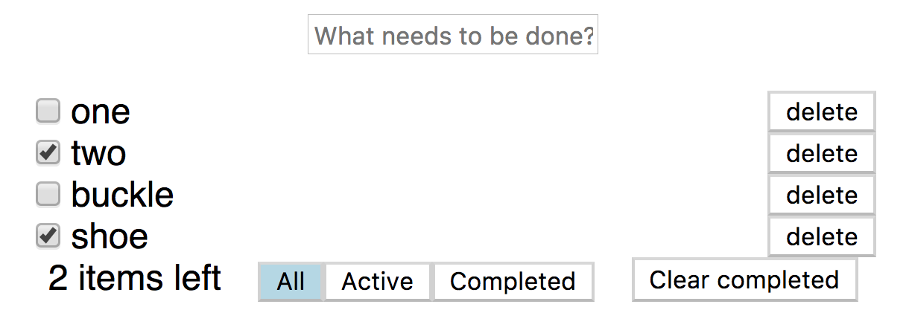

# Recordize &middot; [](https://travis-ci.org/ricokahler/recordize)

> a state management library revolving around simplicity amd immutable records

**This library is a big work-in-progress!** There are no released versions yet. Check back soon.

Recordize is a Redux-alternative library for state management in React applications that revolve around immutable records. The main goal of this library is provide *simple* way to structure React applications that utilize all the optimizations possible from using immutable data..

The basic development flow goes like this:

1. Create immutable record classes that will hold global/shared app state.
2. Add methods that return copies of the records as "actions"
3. Use `store.connect()` with `this.store` and `this.setStore` to create components that use the store.

# [The counter example](./examples/counter)

```js
import * as React from 'react';
import * as Record from 'recordize';

class CounterRecord extends Record.define({
  count: 0,
}) {
  // add methods to create "actions"
  // these methods uses the method of immutable.js to return an immutable copy of itself
  increment() { return this.update('count', count => count + 1); }
  decrement() { return this.update('count', count => count - 1); }
}

const store = Record.createStore(new CounterRecord());

class App extends store.connect() {
  handlePlusClick = () => {
    // `store.increment()` returns a new store
    this.setStore(store => store.increment());
  }

  handleMinusClick = () => {
    // you can also use the immutable.js methods to mutate the store
    // the only requirement is that you have to return a copy of the store
    this.setStore(store => store.update('count', count => count - 1));
  }

  render() {
    return <div>
      <h1>Count: {this.store.count}</h1>
      <button onClick={this.handleMinusClick}>-</button>
      <button onClick={this.handlePlusClick}>+</button>
    </div>;
  }
}

export default App;
```

# [Todo Example](./examples/todos/)



# Planned features

* serialization/deserialization
* fast JSON merge-patch for efficient network requests
* server side endpoint factory
* calculated property hashing
* compatibility with Redux middleware

Check back soon for more development news. Drop an issue if you'd like to see a feature or if you want to help out.